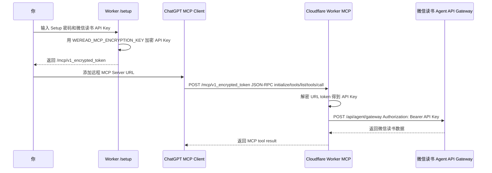

# WeRead MCP Worker

把微信读书接入 ChatGPT / OpenAI Remote MCP 的单用户 Cloudflare Worker。

这个项目会把你的微信读书 Agent API Key 加密进 MCP URL 路径，例如：

```text
https://your-worker.example.workers.dev/mcp/v1_<encrypted-token>
```

ChatGPT 添加这个远程 MCP Server 后，Worker 会在每次 MCP 请求中从 URL 路径解密出微信读书 API Key，再通过微信读书 Agent API Gateway 读取你的书架、笔记、划线、阅读统计等数据。

> [!WARNING]
> 生成后的 MCP URL 是敏感凭据。虽然路径里存放的是密文，但这个 URL 仍然等价于访问你微信读书数据的 bearer token。不要公开、截图、发给别人或提交到 GitHub。

---

## 功能特性

- 部署在 Cloudflare Workers。
- 单用户设计，不需要数据库、KV、D1 或 R2。
- Setup 页面生成加密 MCP URL。
- 微信读书 API Key 不写入仓库，不写入 `wrangler.toml`。
- 支持 ChatGPT Developer Mode 的完整 MCP tools。
- 额外提供 `search` / `fetch` 两个兼容工具，方便符合 OpenAI data-only MCP 约定的场景。
- 只读能力；不提供写入书架、修改笔记、删除数据等操作。
- 一键安装脚本：`scripts/install.sh`。
- 发布 GitHub 前的敏感信息检查脚本：`scripts/check-secrets.sh`。

---

## 当前支持的微信读书能力

本项目基于 `https://cdn.weread.qq.com/skills/weread-skills.zip` 中的微信读书 Skill 文档实现。

### 统一微信读书网关

```text
POST https://i.weread.qq.com/api/agent/gateway
```

请求头：

```text
Authorization: Bearer $WEREAD_API_KEY
Content-Type: application/json
```

请求体规则：

```json
{
  "api_name": "/store/search",
  "keyword": "三体",
  "count": 10,
  "skill_version": "1.0.3"
}
```

重要规则：业务参数必须与 `api_name`、`skill_version` 平铺在同一层，不能包进 `params`。

### MCP tools

| Tool | 微信读书接口 | 说明 |
|---|---|---|
| `search` | `/store/search` | OpenAI data-only 兼容搜索工具，返回 `id/title/url` |
| `fetch` | `/book/info` | OpenAI data-only 兼容详情工具，支持 `book:<bookId>` |
| `weread_search_books` | `/store/search` | 搜索书籍、作者、有声书、全文、书单等 |
| `weread_get_bookshelf` | `/shelf/sync` | 获取书架概览，正确统计电子书、专辑/有声书和文章收藏入口 |
| `weread_get_profile` | `/shelf/sync` + `/book/getprogress` + `/readdata/detail` + `/user/notebooks` + 可选 `/book/bookmarklist` | 获取综合阅读概况，对应 Skill 里的 profile 工作流 |
| `weread_get_book_info` | `/book/info` | 获取书籍基本信息 |
| `weread_get_book_chapters` | `/book/chapterinfo` | 获取章节目录和 `chapterUid` |
| `weread_get_reading_progress` | `/book/getprogress` | 获取阅读进度和阅读时长 |
| `weread_get_notebooks` | `/user/notebooks` | 获取所有有笔记的书及笔记数量统计 |
| `weread_get_book_highlights` | `/book/bookmarklist` | 获取单本书个人划线内容，不含书签位置内容 |
| `weread_get_book_reviews_mine` | `/review/list/mine` | 获取单本书个人想法/点评 |
| `weread_get_book_notes` | `/book/bookmarklist` + `/review/list/mine` | 组合获取单本书可导出的笔记内容：划线 + 想法/点评 |
| `weread_get_chapter_underlines` | `/book/underlines` | 获取章节划线热度统计，不含划线文本 |
| `weread_get_best_bookmarks` | `/book/bestbookmarks` | 获取全书或章节热门划线 |
| `weread_get_readreviews` | `/book/readreviews` | 获取热门划线下的想法/评论 |
| `weread_get_review_detail` | `/review/single` | 获取单条想法/点评详情 |
| `weread_get_public_reviews` | `/review/list` | 获取书籍公开点评 |
| `weread_get_reading_stats` | `/readdata/detail` | 获取阅读统计：周、月、年、总计 |
| `weread_get_recommendations` | `/book/recommend` | 获取个性化推荐 |
| `weread_get_similar_books` | `/book/similar` | 获取相似书推荐 |

---

## 工作原理



---

## 安全模型

### 这个项目保护什么？

- 微信读书 API Key 不会明文出现在 Git 仓库里。
- API Key 不会明文保存在 Worker 配置文件里。
- URL 路径里的 API Key 使用 Worker Secret `WEREAD_MCP_ENCRYPTION_KEY` 加密。
- Worker 代码不主动记录完整 URL、API Key 或加密 token。

### 这个项目不保护什么？

- 生成后的 MCP URL 本身仍然是敏感凭据。任何拿到 URL 的人都可以使用这个 MCP Server。
- 如果你开启了 Cloudflare 访问日志、边缘日志、第三方代理日志，完整 URL path 可能被平台或代理记录。
- 如果你把生成后的 MCP URL 复制给别人或提交到 GitHub，密文路径就泄露了。
- 这是单用户设计，不是多租户权限系统。

### 建议

- 只把 Worker 部署给自己使用。
- 不要分享生成后的 MCP URL。
- 不要把 `.dev.vars`、`.env`、真实 API Key、真实 MCP URL 提交到 GitHub。
- 如果怀疑 URL 泄露，立刻重新设置 `WEREAD_MCP_ENCRYPTION_KEY`，重新部署并重新生成 MCP URL。
- 定期更新微信读书 API Key 和 MCP URL。

---

## 前置条件

- Node.js 20+。
- npm。
- Cloudflare 账号。
- 已登录 Wrangler，或允许安装脚本打开 Wrangler 登录流程。
- 微信读书 API Key，格式通常类似 `wrk-...`。

---

## 快速开始：一键安装

```bash
git clone https://github.com/<your-name>/weread-mcp-worker.git
cd weread-mcp-worker
./scripts/install.sh
```

脚本会做这些事：

1. 安装 npm 依赖。
2. 询问 Worker 名称。
3. 检查 Wrangler 登录状态。
4. 生成随机 `WEREAD_MCP_ENCRYPTION_KEY`。
5. 询问或自动生成 `WEREAD_MCP_SETUP_PASSWORD`。
6. 部署 Cloudflare Worker。
7. 通过 `wrangler secret put` 上传 Worker secrets。
8. 输出 `/setup` 页面地址。

安装完成后打开：

```text
https://<your-worker>.workers.dev/setup
```

输入：

- Setup 密码。
- 微信读书 API Key。

然后复制页面生成的 MCP URL。

---

## 手动部署

### 1. 安装依赖

```bash
npm install
```

### 2. 登录 Cloudflare

```bash
npx wrangler login
```

### 3. 设置 Worker secret

生成加密密钥：

```bash
node scripts/generate-secret.mjs
```

设置 secrets：

```bash
npx wrangler secret put WEREAD_MCP_ENCRYPTION_KEY
npx wrangler secret put WEREAD_MCP_SETUP_PASSWORD
```

也可以使用密码 hash，而不是保存明文 Setup 密码：

```bash
printf 'your-setup-password' | node scripts/generate-secret.mjs sha256
npx wrangler secret put WEREAD_MCP_SETUP_PASSWORD_SHA256
```

如果同时设置了 `WEREAD_MCP_SETUP_PASSWORD_SHA256` 和 `WEREAD_MCP_SETUP_PASSWORD`，Worker 会优先使用 hash。

### 4. 部署

```bash
npm run deploy
```

### 5. 生成 MCP URL

打开：

```text
https://<your-worker>.workers.dev/setup
```

输入 Setup 密码和微信读书 API Key，获得：

```text
https://<your-worker>.workers.dev/mcp/v1_<encrypted-token>
```

---

## 在 ChatGPT 中添加 MCP Server

截至 2026-05-16，OpenAI 文档中 ChatGPT Developer Mode 支持完整 MCP client，可在 ChatGPT 设置中导入远程 MCP Server，并支持 SSE 和 Streamable HTTP。本项目实现的是 **Streamable HTTP JSON response 模式**：

- `POST /mcp/<token>`：MCP JSON-RPC 请求。
- `GET /mcp/<token>`：返回 `405 Method Not Allowed`，表示不提供 SSE stream。

一般步骤：

1. 打开 ChatGPT。
2. 进入 Settings。
3. 打开 Connectors。
4. 在 Advanced 中启用 Developer mode。
5. 在 Connectors tab 添加远程 MCP Server。
6. 填入 `/setup` 生成的 MCP URL。
7. 保存后，在对话里的 Developer Mode / Connectors 工具中启用这个 server。

测试问题示例：

```text
列出我的微信读书书架前 10 本书。
```

```text
总结一下我的微信读书阅读概况。
```

```text
帮我看看我在《三体》里的划线和想法。
```

```text
统计我今年在微信读书读了多久。
```

---

## OpenAI API 远程 MCP 示例

如果你想通过 Responses API 测试远程 MCP，可参考下面形式。这里的 `server_url` 使用 `/setup` 生成的完整 MCP URL。

```json
{
  "type": "mcp",
  "server_label": "weread",
  "server_url": "https://<your-worker>.workers.dev/mcp/v1_<encrypted-token>",
  "require_approval": "never"
}
```

如果只想使用 data-only 兼容工具，可以限制：

```json
{
  "type": "mcp",
  "server_label": "weread",
  "server_url": "https://<your-worker>.workers.dev/mcp/v1_<encrypted-token>",
  "allowed_tools": ["search", "fetch"],
  "require_approval": "never"
}
```

---

## 本地开发

复制本地变量模板：

```bash
cp .dev.vars.example .dev.vars
```

编辑 `.dev.vars`，填入仅用于本地开发的值。

启动开发服务器：

```bash
npm run dev
```

打开：

```text
http://localhost:8787/setup
```

---

## Smoke test

生成 MCP URL 后，可以测试初始化和 tools 列表：

```bash
node scripts/smoke-test.mjs 'https://<your-worker>.workers.dev/mcp/v1_<encrypted-token>'
```

这个脚本会调用：

- `initialize`
- `notifications/initialized`
- `tools/list`

它不会调用微信读书 API，因此不会验证 API Key 是否有效。要验证微信读书 API Key，请在 ChatGPT 或 MCP 客户端里调用一个真实工具，例如 `weread_get_bookshelf`。

---

## 开发命令

```bash
npm run typecheck
npm test
npm run check
npm run deploy
```

---

## 配置项

| 名称 | 类型 | 必需 | 是否敏感 | 说明 |
|---|---|---:|---:|---|
| `WEREAD_MCP_ENCRYPTION_KEY` | Cloudflare secret | 是 | 是 | 用于加密/解密 URL path token |
| `WEREAD_MCP_SETUP_PASSWORD` | Cloudflare secret | 是，除非使用 hash | 是 | Setup 页面密码 |
| `WEREAD_MCP_SETUP_PASSWORD_SHA256` | Cloudflare secret | 否 | 是 | Setup 页面密码的 SHA-256 hex；设置后优先使用 |
| `WEREAD_SKILL_VERSION` | var | 否 | 否 | 微信读书 Skill 版本，默认 `1.0.3` |
| `WEREAD_GATEWAY_URL` | var/secret | 否 | 否 | 微信读书 Agent API Gateway，默认官方网关 |
| `WEREAD_MCP_ALLOWED_ORIGINS` | var | 否 | 否 | 额外允许的浏览器 Origin，逗号分隔 |

---

## 微信读书接口注意事项

### API Key

微信读书 Skill 文档说明 API Key 来自环境变量 `WEREAD_API_KEY`，格式通常是：

```text
wrk-xxxxxxxx
```

本项目不需要你把这个值设置成 Worker secret。你只需要在 `/setup` 页面输入它，Worker 会把它加密进生成的 MCP URL。

### `skill_version`

当前从 zip 中识别到的版本是：

```text
1.0.3
```

如微信读书接口返回 `upgrade_info`，说明上游 Skill 版本要求变化，需要更新项目中的 `WEREAD_SKILL_VERSION` 或代码。

### 笔记口径

`/user/notebooks` 中：

```text
单本书总笔记数 = reviewCount + noteCount + bookmarkCount
```

其中：

- `reviewCount`：想法/点评数，包含划线想法、书评想法、书摘、非书籍想法等个人内容。
- `noteCount`：划线/高亮原文条数，不是单本书总笔记数。
- `bookmarkCount`：书签数量。当前接口只提供数量，不提供书签位置内容导出。

`weread_get_book_notes` 导出的内容范围是：

```text
划线内容 + 想法/点评内容
```

不包含书签位置内容。

### 书架数量口径

书架总条目必须按下面规则计算：

```text
books.length + albums.length + (mp 非空 ? 1 : 0)
```

其中：

- `books[]`：电子书/导入书/公众号类书籍条目。
- `albums[]`：专辑/有声书，也属于书架里的书。
- `mp`：文章收藏入口，非空时计为 1 个书架条目。

### 阅读时长

微信读书阅读统计中的时长字段以秒为单位。本项目会额外返回部分人类可读字段，例如：

```text
2小时15分钟
```

---

## 发布到 GitHub 前检查

### 1. 确认 Git 状态

```bash
git status --short
```

### 2. 确认不会提交本地 secrets

```bash
git diff --cached
```

### 3. 运行项目内检查脚本

```bash
./scripts/check-secrets.sh
```

### 4. 可选：使用 gitleaks

```bash
gitleaks detect --source .
```

### 5. 不要提交这些内容

- `.dev.vars`
- `.env`
- 真实微信读书 API Key
- 真实 MCP URL
- Cloudflare API Token
- 任何 cookie 或 session 信息

---

## 故障排查

### ChatGPT 无法连接 MCP Server

检查：

1. URL 是否是完整 `/mcp/v1_<encrypted-token>`，不是 `/setup`。
2. Worker 是否已经部署成功。
3. `WEREAD_MCP_ENCRYPTION_KEY` 是否已设置。
4. ChatGPT Developer Mode 是否已启用。
5. Worker 日志中是否有 401、403、500。

### 返回 `Invalid MCP URL token`

常见原因：

- 复制 URL 时漏了一部分。
- 重新设置过 `WEREAD_MCP_ENCRYPTION_KEY`，旧 URL 无法解密。
- URL 被聊天软件、Markdown 或浏览器自动换行截断。

解决：重新访问 `/setup` 生成 MCP URL。

### Setup 页面提示密码错误

检查：

- `WEREAD_MCP_SETUP_PASSWORD` 是否正确。
- 如果使用 `WEREAD_MCP_SETUP_PASSWORD_SHA256`，确认 hash 是对原始密码计算的 SHA-256 hex。
- 如果两个变量都设置了，Worker 优先使用 `WEREAD_MCP_SETUP_PASSWORD_SHA256`。

### 微信读书认证失败

检查：

- API Key 是否有效。
- API Key 是否属于当前微信读书账号。
- 是否复制了多余空格或换行。
- 微信读书 Agent API 是否变更。

重新在 `/setup` 输入新的 API Key 生成 URL。

### 笔记或书架数据不完整

- `weread_get_notebooks` 使用 `lastSort` 游标分页，不支持 offset/limit。
- 大列表默认会限制返回数量，避免 MCP 响应过大。
- 需要全量笔记概览时，使用 `fetchAll: true` 和合理的 `maxPages`。

### Worker 日志中是否会出现 API Key？

项目代码不会主动记录 API Key、加密 token 或完整请求 URL。但如果你启用了 Cloudflare 平台层请求日志，URL path 仍可能被记录。请按敏感信息处理生成后的 MCP URL。

---

## 非官方声明

本项目不是微信读书官方项目，也不是 OpenAI 官方项目。微信读书 Agent API 行为可能变化。请仅用于访问你自己的数据，并遵守微信读书相关服务条款、版权规则和使用限制。

---

## License

MIT
